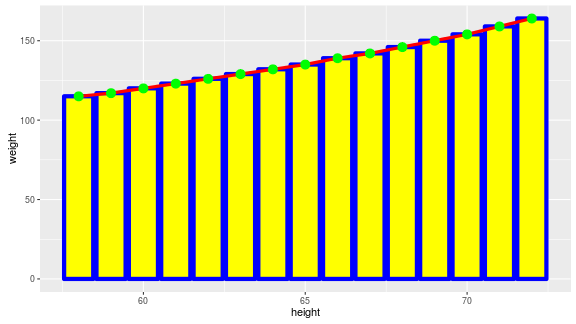
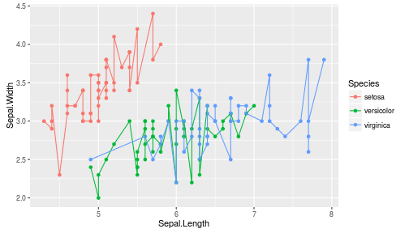
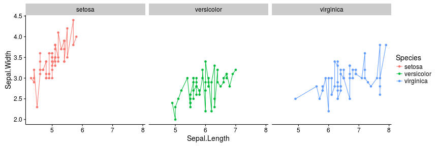
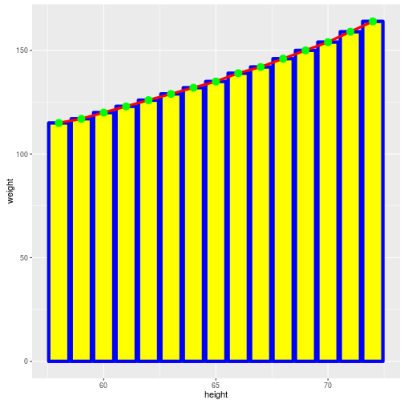
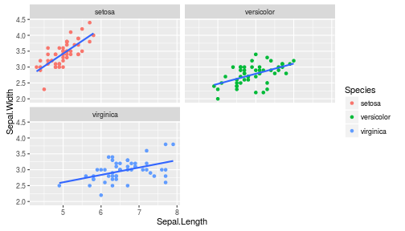
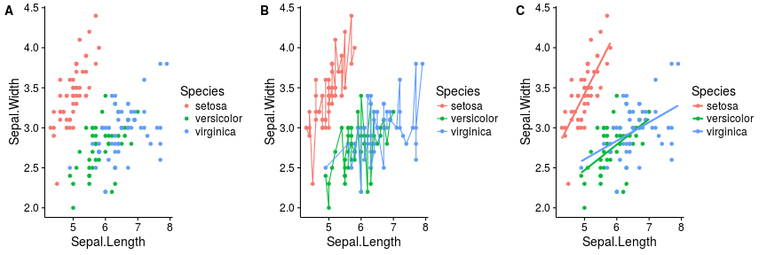

## Intro Slide

Overview slide with presentation aims

Get you up and running with ggplot2

Get you confortable with ggplot2

Get you wanting to explore more

--- .class #id 

## Noob 1: Setup - Geoms wanted!

Intro to ggplot2 with a simple dataset "women", which comes with the base (standard) R setup


```r
# load ggplot2, then load data: 2 for 1 line special! 
library(ggplot2); data(women) 

## 1) will produce blank plot... no geom specified!
myBlankPlot = ggplot(women, aes(height, weight)) # recommended
myBlankPlot2 = ggplot(women) # contains data only
myBlankPlot3 = ggplot() # "empty" object

# 2) will produce basic line graph via geom_line()
myPlot = ggplot(women, aes(height, weight)) + geom_line()
```
See <b>?ggplot</b> for more detail  

<b style="color:red">Note:</b> ggplot2 enables iterative building of complex graphics in <b style="color:blue;">layers</b> via <span style="color:red;">&#10133;</span> (plus) operator  

--- .class #id

## Noob 2: our first result!


```r
myPlot # or you can use: plot(myPlot) or print(myPlot)
```


--- .class #id

## Noob 3: alternative plot setup

These variations will produce the same output as myPlot (so one is not pondering the "right" way to setup plots)

This can be very useful when constructing complex plots or working with functions (<b>control flow!</b>)


```r
# These variants will all work... try them out!

ggplot(women) + aes(height, weight) + geom_line()
ggplot(women) + geom_line(mapping = aes(height, weight))
ggplot() + geom_line(data = women, mapping = aes(height, weight))
ggplot() + geom_line(data = women) + aes(height, weight)

#odd.. but makes sense
ggplot() + aes(height, weight) + geom_line(data = women) 
```

<br/>
<b style="color:red">Takehome:</b> There is quite a bit of flexibility in ggplot2 oject creation. 

--- .class #id

## Noob 4: Aesthetics Geoms?
<b>Aesthetics:</b> define visual or other attributes of ggplot objects
* Can be specified as an argument to either <code class="r">aes()</code> or to the <b>geom</b> to be modified.
* Examples aesthetics: colour, point type, point size, line size...

<b>Geoms:</b> aka "geometrics objects""
* define the type of the plot produced
* There are soo many geoms

<b style="color:red">Note:</b>  
* these may mean different things to different geoms  
* some geoms may not accept certain aesthetics   
* these are good concepts to understand via "dirty hands"!  
* Useful reference: http://docs.ggplot2.org/current/index.html  

--- .class #id

## Noob 5: Behold... the combo plot!

```r
# Examples: one plot... 3 geoms... many aesthetics!
myCustomPlot = ggplot(women, aes(height, weight)) + 
    geom_bar(stat="identity", color="blue", fill="yellow", size=2) + 
    geom_line(color="red", size = 1.5) + geom_point(color = "green", size = 4)
myCustomPlot # note draw order: layers stacked from bottom to top!!
```


<b style="color:red;">Note:</b> stat="identity" means no stat stansformations (plot values as is)

--- .class #id

## Noob 6: Labels anyone?


```r
myCustomPlot = myCustomPlot + labs(x = "female height", y = "female weight", 
                                   title = "women: height vs. weight")
myCustomPlot # or you can use: plot(myCustomPlot) or print(myCustomPlot)
```


Reference: http://docs.ggplot2.org/current/labs.html  
<b style="color:red;">Note:</b> another example of ggplot2 <b>iterative</b> plot building.

See <b>?ggplot</b> for more detail  

--- .class #id

## Mid 1: This makes no sense?

Welcome to iris! A slightly more complex dataset (also available in base R)


```r
data(iris) # seriously... this is almost there but not quite..
ggplot(iris, aes(Sepal.Length, Sepal.Width)) + geom_point(aes(color=Species)) + 
    geom_line(aes(color=Species))
```



--- .class #id

## Mid 2: This makes more sense

Facets anyone?


```r
# facet_grid() call's formula: separate all data (.) according to "Species" variable
ggplot(iris, aes(Sepal.Length, Sepal.Width)) + geom_point(aes(color=Species)) + 
    geom_line(aes(color=Species)) + facet_grid(. ~ Species)
```



Reference: http://docs.ggplot2.org/current/facet_grid.html

--- .class #id

## Mid 3: Another way of wrapping it?

Facets anyone?


```r
# facet_wrap() call's formula: as above, but no dot (go figure)
ggplot(iris, aes(Sepal.Length, Sepal.Width)) + geom_point(aes(color=Species)) + 
    geom_line() + facet_wrap(~ Species, ncol=2)
```



Reference: http://docs.ggplot2.org/current/facet_wrap.html

--- .class #id

## Mid 4: The model citizen!

simple linear model application via <b style="color:red;">geom_smooth()</b>!


```r
ggplot(iris, aes(Sepal.Length, Sepal.Width)) + geom_point(aes(color=Species)) + 
    facet_wrap(~ Species, ncol=2) + geom_smooth(method="lm", se = FALSE) 
```



Reference: http://docs.ggplot2.org/current/geom_abline.html  
<b style="color:red;">Note:</b> see the docs for many ways to apply lines!

--- .class #id

## Mid 5: What's my, What's my THEME!


Reference: http://docs.ggplot2.org/current/theme.html  
<b style="color:red;">More</b> on themes: https://www.r-bloggers.com/ggplot2-themes-examples/

--- .class #id


## Mid 6: That's my THEME!


--- .class #id

## Mid X: Moo!
Introducing cowplot


```r
# facet_wrap() call's formula: as above, but no dot (go figure)
plot_grid
```

```
## Error in eval(expr, envir, enclos): object 'plot_grid' not found
```

```r
ggplot(iris, aes(Sepal.Length, Sepal.Width)) + geom_point(aes(color=Species)) + 
    geom_line() + facet_wrap(~ Species, ncol=2)
```



Reference: http://docs.ggplot2.org/current/facet_wrap.html

--- .class #id

## Mid 1: Groups you say


--- .class #id

## Mid 1: Groups you say


--- .class #id


## Geek note: library vs require?

Why use require() over library()?


```r
isLoadedByLibrary = library(ggplot2); isLoadedByLibrary
```

```
## [1] "ggplot2"   "stats"     "graphics"  "grDevices" "utils"     "datasets" 
## [7] "methods"   "base"
```

```r
isLoadedByRequire = require(ggplot2); isLoadedByRequire
```

```
## [1] TRUE
```

<b style="color:red;"> Takehome</b>: require can be used in control flow (e.g. dependency checking)

--- .class #id

## Slide 4

Slide content check!


--- .class #id

## Slide 5

Slide 5


--- .class #id
