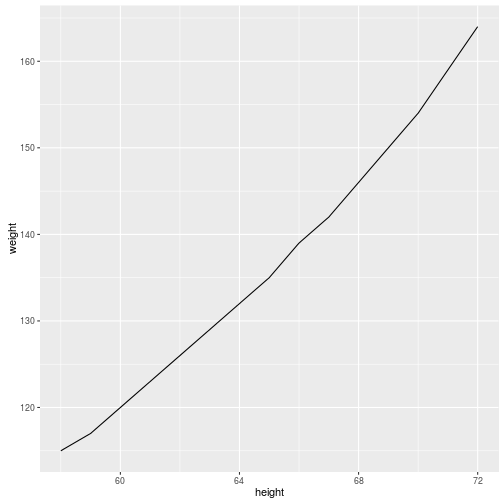

## Intro Slide

Overview slide with presentation aims

--- .class #id 

## Beginner's Section 0

Creating ggplot objects: There are three main ways

Quote directly out of help! ?ggplot


```r
# recommended option
ggplot(dataFrame, aes(x, y, <other aesthetics>))

# other options 
ggplot(dataFrame)
ggplot()
```

see <b>?ggplot</b> for more :)

NOTE: Can call directly or assign to variable  

NOTE: None of these will produce a plot... further instruction required

Brief note: Aesthetics.. e.g. colour, point type, point size, line size

--- .class #id

## Beginner's Section 1 - Example

Will be playing with a simple dataset "women", which comes with the base (standard) R setup

Geom_Wanted!


```r
require(ggplot2) # load ggplot2. same as library(ggplot2)
data(women) # load data

# will produce blank plot - no geom specified
myPlot = ggplot(women, aes(height, weight))
# will produce basic line graph
myPlot = ggplot(women, aes(height, weight)) + geom_line()
```

Note: ggplot2 allows for iterative building of complex graphics via the &#10133; (plus) operator

--- .class #id

## The result


```r
myPlot
```



Note: This is the result with Geom

--- .class #id

## These will also work

These 


```r
# ggplot(women) + aes(height, weight) + geom_line()
ggplot(women) + geom_line(mapping = aes(height, weight))
```


Takehome: There is quite a bit of flexibility in ggplot2 oject creation.  

<b>Caveat emptor!</b>

--- .class #id

## Barplots?

Changing the Geom 


```r
# briefly explain "stat" aesthetic (i think it is an aesthetic)
myBarplot = ggplot(women, aes(height, weight)) + geom_bar(stat="identity")
myBarplot
```


--- .class #id

## Combining Geoms


```r
# briefly explain "stat" aesthetic (i think it is an aesthetic)
myCustomPlot = ggplot(women, aes(height, weight)) + 
    geom_bar(stat="identity", color="blue", fill="yellow", size=2) + 
    geom_line(color="red", size = 1.5) + 
    geom_point(color = "green", size = 4)
```

--- .class #id

## Behold! The combo plot


```r
myCustomPlot # or you can use: plot(myCustomPlot) or print(myCustomPlot)
```


--- .class #id


## Geek note: library vs require?

Why use require() over library()?


```r
# option A
isLoadedByLibrary = library(ggplot2); isLoadedByLibrary
```

```
## [1] "ggplot2"   "stats"     "graphics"  "grDevices" "utils"     "datasets" 
## [7] "methods"   "base"
```

```r
# option B
isLoadedByRequire = require(ggplot2); isLoadedByRequire
```

```
## [1] TRUE
```

<b style="color:red;"> Takehome</b>: require can be used in control flow (e.g. dependency checking)

--- .class #id

## Slide 4

Slide content check!


--- .class #id

## Slide 5

Slide 5


--- .class #id
